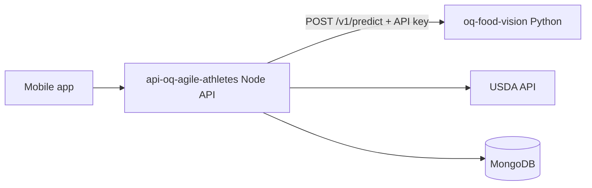

# OQ Food Vision

Standalone Python microservice that classifies food photos for the **OQ Agile Athletes** fitness/nutrition app. It replaces Clarifai `food-item-recognition` with a self-hosted Food-101 model.

**Default backend:** [ONNX Runtime](https://onnxruntime.ai/) + [onnx-community/swin-finetuned-food101-ONNX](https://huggingface.co/onnx-community/swin-finetuned-food101-ONNX) (~350MB download, fast CPU inference, works on Python 3.11–3.14).

This service returns ranked food labels with confidence scores only. It does **not** call USDA, store user data, or handle mobile authentication — that lives in the sibling **Node/Express** API.

## Relationship to api-oq-agile-athletes



| Repository | Role |
|------------|------|
| **This repo (Python)** | Image → `concepts[]` with confidence scores |
| **api-oq-agile-athletes (Node)** | Auth, routes, USDA enrichment, MongoDB, mobile contract |

The Node API will call this service over HTTP using:

- `FOOD_VISION_URL` — e.g. `https://your-service.onrender.com`
- `FOOD_VISION_API_KEY` — shared secret (header `X-Food-Vision-Key` or `Authorization: Bearer`)

### Expected Node integration (separate PR)

```typescript
// services/foodVisionClient.ts → POST /v1/predict
// services/foodService.ts analyzeImage() maps response.concepts → USDA lookup
```

Env vars on Node: `FOOD_VISION_PROVIDER=http`, `FOOD_VISION_URL`, `FOOD_VISION_API_KEY`, `FOOD_VISION_TIMEOUT_MS=60000`.

---

## API

### `GET /health`

No auth. Returns `{ "status": "ok" }` immediately (server is up).

### `GET /ready`

No auth. Returns `200` when the model is loaded, `503` while loading or on load failure.

### `POST /v1/predict`

**Auth:** `X-Food-Vision-Key: <key>` or `Authorization: Bearer <key>`

**Request:**

```json
{ "imageBase64": "<base64 string, optional data:image/jpeg;base64, prefix>" }
```

**Response:**

```json
{
  "concepts": [
    { "name": "pizza", "confidence": 0.94 },
    { "name": "cheeseburger", "confidence": 0.03 }
  ],
  "model": "onnx-community/swin-finetuned-food101-ONNX",
  "inferenceMs": 420
}
```

**Errors:** JSON `{ "detail": "..." }` — `400`, `401`, `413`, `422`, `500`, `503`.

OpenAPI docs: `/docs` when `ENABLE_DOCS=true`.

---

## Accuracy limitations

- Food-101 labels are **dish-level** (~101 types: pizza, sushi, steak), not ingredients or brands.
- Node's `foodKeywords` filter may need relaxation when switching from Clarifai — this service returns honest top-K; Node owns business filtering.
- USDA mapping quality depends on label strings (e.g. `chicken curry` from `chicken_curry`).

---

## Local development

**Requirements:** Python 3.11+ (3.14 supported with ONNX backend). ~512MB RAM after model load.

```bash
python -m venv .venv
# Windows: .venv\Scripts\activate
# macOS/Linux: source .venv/bin/activate

pip install -r requirements-dev.txt

cp .env.example .env
# Edit FOOD_VISION_API_KEY in .env

python scripts/download_fixture.py   # tests/fixtures/pizza.jpg

python -m uvicorn app.main:app --port 8000
```

The server starts **immediately**. The model loads in the background — poll `/ready` until `"status": "ready"` (first run downloads weights from Hugging Face, ~1–3 min).

**Smoke test** (server must be running and `/ready` = ready):

```powershell
python scripts/smoke_predict.py
```

The script reads `FOOD_VISION_API_KEY` from `.env` automatically.

**Tests** (mocked classifier — no model download):

```powershell
python -m pytest -m "not integration" -q
```

**Integration test** (downloads real ONNX model):

```powershell
python -m pytest -m integration -q
```

### Legacy PyTorch backend

PyTorch + `nateraw/food` requires **Python 3.11–3.13** (not 3.14) and ~2GB RAM:

```bash
pip install -r requirements-torch.txt
```

Set in `.env`:

```
INFERENCE_BACKEND=torch
MODEL_ID=nateraw/food
```

---

## Environment variables

| Variable | Required | Default | Description |
|----------|----------|---------|-------------|
| `FOOD_VISION_API_KEY` | yes | — | Shared secret with Node API |
| `INFERENCE_BACKEND` | no | `onnx` | `onnx` or `torch` |
| `MODEL_ID` | no | `onnx-community/swin-finetuned-food101-ONNX` | Hugging Face repo |
| `ONNX_MODEL_FILE` | no | `onnx/model.onnx` | ONNX file path in repo |
| `PORT` | no | `8000` | HTTP port |
| `TOP_K` | no | `5` | Max predictions (1–10) |
| `MAX_BASE64_CHARS` | no | `900000` | Aligns with Node image limit |
| `INFERENCE_TIMEOUT_SEC` | no | `55` | Per-request inference timeout |
| `LOG_LEVEL` | no | `info` | Logging level |
| `ENABLE_DOCS` | no | `true` | OpenAPI at `/docs` |
| `HF_HOME` | no | — | Model cache directory |

---

## Docker

```bash
docker build -t oq-food-vision .
docker run --rm -p 8000:8000 \
  -e FOOD_VISION_API_KEY=your-secret-key-here \
  oq-food-vision
```

Uses Python 3.11 and the ONNX backend by default.

---

## Deploy on Render

1. Create a **Python web service** (Starter plan, ~512MB RAM is enough for ONNX).
2. Set `FOOD_VISION_API_KEY` in the dashboard.
3. Use `render.yaml` or set `INFERENCE_BACKEND=onnx` and the model env vars from `.env.example`.
4. Health check: `/health` (liveness). Use `/ready` before routing traffic.

---

## Security

- Not intended for direct mobile client access — only the Node API should call `/v1/*`.
- Do not log full base64 image payloads.
- Restrict CORS via `CORS_ORIGINS` or Render private networking + API key.

---

## Project layout

```
app/
  main.py              # FastAPI app, background model load
  config.py
  services/
    classifier.py      # Factory + image utils
    onnx_classifier.py # Default ONNX backend
    torch_classifier.py
tests/
scripts/smoke_predict.py
```
